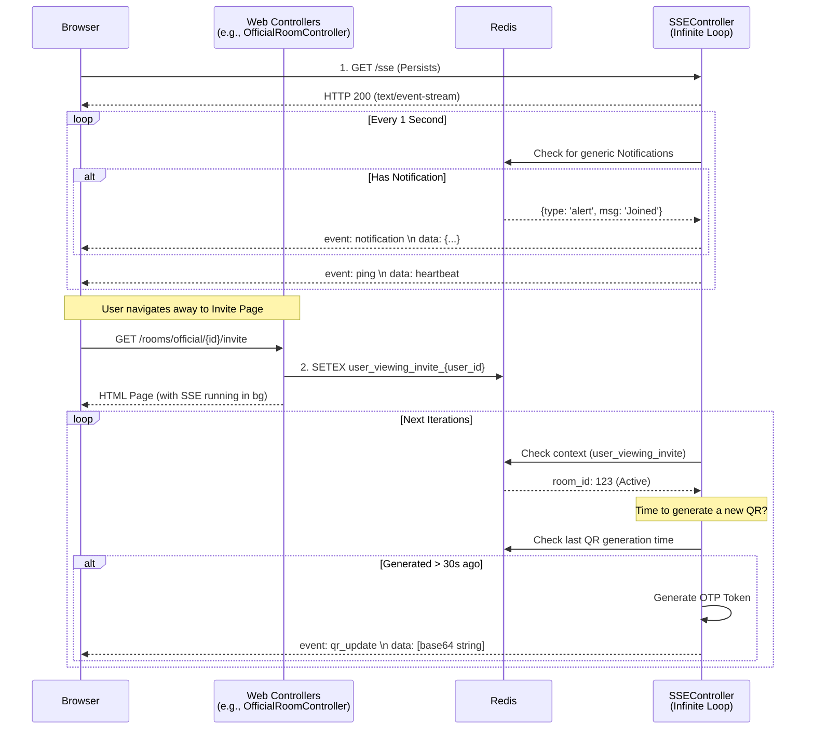

# Unified Server-Sent Events (SSE) Architecture

This document describes the design behind utilizing a single, unified SSE connection to push different types of real-time events (QR Codes, Notifications, Heartbeats) to the frontend simultaneously using Laravel and Redis.

## Why a Single Connection?

Modern browsers impose strict limits on concurrent connections to the same domain (usually 6). Opening a new SSE connection for every feature (e.g., one for QR codes, one for chat, one for notifications) quickly exhausts this limit, causing later requests (even standard AJAX calls or image loads) to stall.

By using a single, long-running connection, we **multiplex** our data: all real-time events share the same pipeline.

## System Components

1.  **Frontend Event Hub (`EventSource`)**
    *   Initiates one connection to `/sse`.
    *   Listens to specific named events (like `qr_update`, `notification`, or `ping`).
    *   Dispatches these events to UI components that need them, only if those components are currently rendered on the page.

2.  **`SSEController` (The Pipeline Head)**
    *   Owns the `/sse` route.
    *   Starts an infinite `while(true)` loop (running typically once per second).
    *   In each iteration, it acts as a "pull mechanism", checking various data stores to see if there is data that needs pushing to the specific connected user.
    *   It uses `StreamedResponse` to flush data chunk-by-chunk to the client.

3.  **Redis (The Bridge & State Store)**
    *   Because the `SSEController` loop might run for minutes or hours, standard stateless HTTP controllers cannot easily tell the loop what the user is currently doing.
    *   We use Redis for two main purposes:
        *   **Context:** When a user visits the "Invite Page", `OfficialRoomController` sets a Redis key indicating the user's current context. The SSE loop reads this and says, "Ah, the user is on the invite page, I should start generating QR codes."
        *   **Queues/Notifications:** If an asynchronous process needs to notify the user, it pushes a payload to a Redis key specific to that user. The SSE loop POPS the next message from this queue and sends it down the wire.

## Data Flow Diagram

## Creating Verifiable Tokens

For QR validation, simple random strings are hard to track. We utilize the `ichtrojan/laravel-otp` package inside the `SSEController` loop. Every 30 seconds (if the context demands it), the system generates a new OTP tied to the User ID and Room ID. This OTP is encoded into the QR. When scanning, the scanner validates this short-lived OTP against the database to confirm it is fresh and legitimate.
